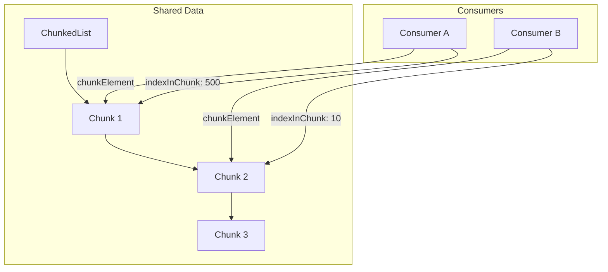

# Consumer Position Tracking

Each consumer maintains its own cursor into the shared `ChunkedList`, allowing for independent reading speeds.

## Mechanism

1.  **Independent Cursors**: Every `Consumer` struct stores:
    *   `chunkElement`: A pointer to the `list.Element` holding the current `ChunkNode`.
    *   `indexInChunk`: An integer index (0-999) within that chunk.
2.  **Lock-Free(ish) Reads**: Consumers track their position using their own mutex (`Consumer.mutex`), only acquiring the global `Queue.mutex` (RLock) to read the actual data pointer.
3.  **Compaction Safety**: When expired items are removed from the head of the list, all consumer positions are automatically adjusted to ensure they don't point to invalid or shifted data.
