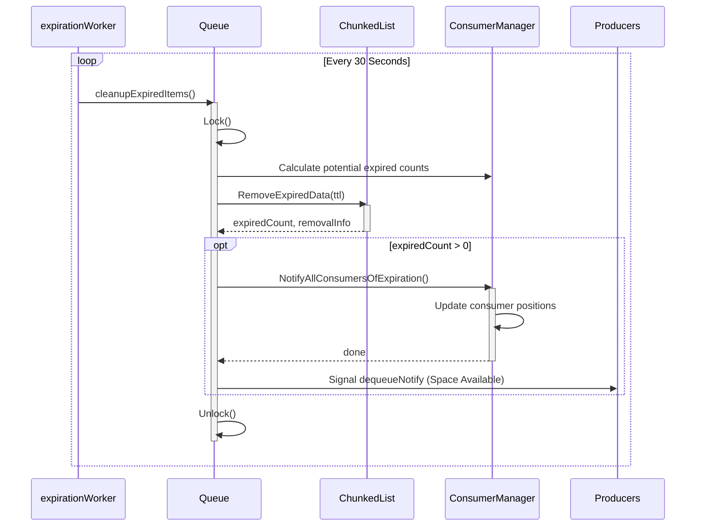

# Expiration Workflow

The queue automatically removes items that have exceeded their Time-To-Live (TTL). This process runs in a background goroutine.

## Steps

1.  **Trigger**: The `expirationWorker` wakes up every 30 seconds.
2.  **Snapshot**: Before modifying the list, the queue calculates how many unread items *would* be expired for each consumer.
3.  **Removal**: `ChunkedList.RemoveExpiredData` iterates from the head, removing chunks or items that are older than the TTL. It returns detailed `removalInfo` about which chunks were affected.
4.  **Adjustment**: `ConsumerManager` uses the `removalInfo` to shift every active consumer's cursor. If a consumer was reading a chunk that got deleted, they are moved to the new head.
5.  **Notification**: Blocked producers (waiting in `Enqueue`) are woken up because space has been freed.
