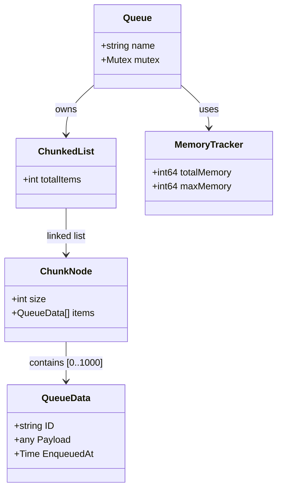

# Memory Layout

The `mpmc-queue` uses a chunked linked list to store data efficiently while maintaining a strict memory limit.

## Key Components

- **ChunkedList**: A linked list where each node contains an array (chunk) of items. This reduces pointer overhead compared to a standard linked list.
- **ChunkNode**: A fixed-size array (default 1000 items) that stores pointers to `QueueData`.
- **MemoryTracker**: Tracks the estimated size of all `QueueData` and `ChunkNode` structures to enforce the global memory limit (default 1MB).
